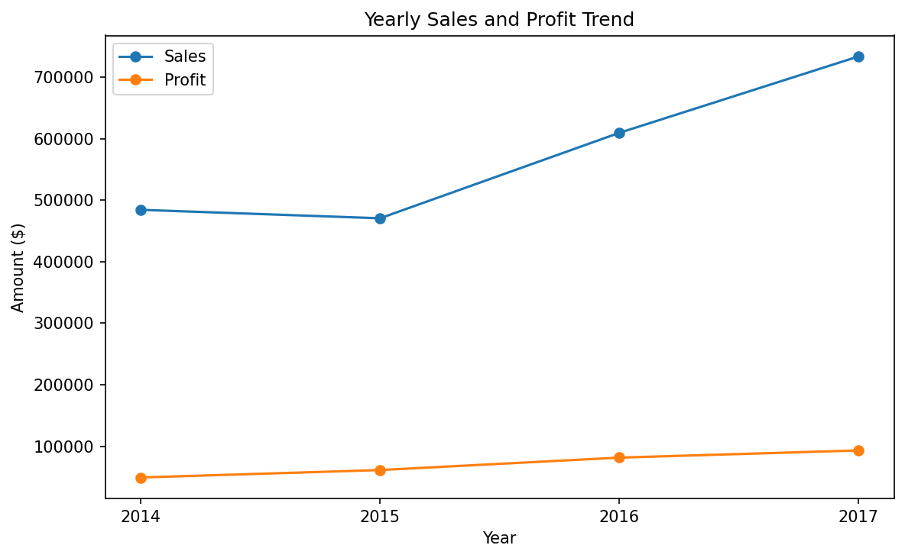
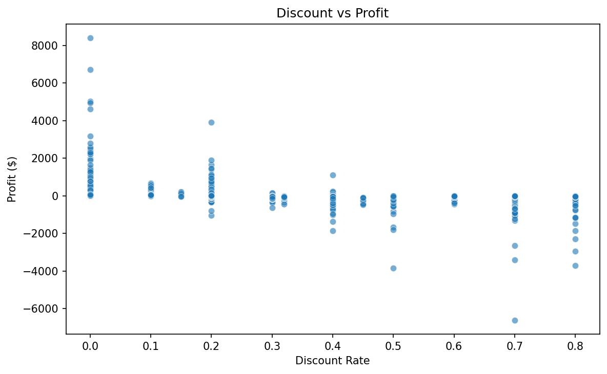

# 🏪 Mini Superstore Analytics

An end-to-end **retail analytics project** built with **Python and SQL**, based on the popular *Sample Superstore* dataset.  
This repository was created as a **personal learning project** to strengthen data cleaning, relational modeling, and EDA skills.

---

## 🎯 Project Overview
A complete **ETL → SQLite → EDA** workflow:
- Load CSV, clean & normalize with **pandas** (and simple **os** utilities)
- Persist to a relational **SQLite** schema
- Explore business questions and generate figures with **Matplotlib** & **Seaborn**

> ℹ️ **Note about the database file**
> This repo **does not include** `superstore.db` and **does not include** your local `venv/`.  
> Recreate the database locally by running `load_data.py` (instructions below).

---

## 🔍 Business Questions
1. Which are the **top 5 most profitable products**?  
2. How does **profit margin** vary by *Category* and *Region*?  
3. Which **customer segment** records the highest loss/return?  
4. What is the **yearly sales and profit trend**?  
5. How does the **discount rate** affect profitability?  

---

## 🧱 Database Schema
Four tables after normalization:

| Table | Description |
|---|---|
| `customers` | Customer details, location, segment |
| `products`  | Product info (category, sub-category) |
| `orders`    | Order metadata (dates, ship mode, customer) |
| `order_items` | Line-level metrics (quantity, sales, discount, profit) |

📄 Full schema: [`sql/create_tables.sql`](sql/create_tables.sql)

---

## ⚙️ Analytical Workflow
1. **ETL (Python):** read CSV → clean text/date/numeric fields → apply business rules → write to SQLite.  
2. **EDA (Notebook):** join tables into an analysis-ready `superstore` DataFrame → compute KPIs & answer questions.  
3. **Reporting:** export charts to `reports/figures/` for GitHub preview.

---

## 🖼️ Example Visuals
| Chart | Description |
|---|---|
|  | Top 5 Most Profitable Products |
|  | Profit Margin by Category & Region |
|  | Yearly Sales & Profit Trend |
|  | Impact of Discount Rate on Profitability |

---

## 📂 Project Structure
```
mini_superstore_analytics/
├── data/
│   └── superstore.csv
├── sql/
│   └── create_tables.sql
├── notebooks/
│   └── eda.ipynb
├── reports/
│   └── figures/
│       ├── yearly_sales_profit_trend.png
│       ├── top5_profitable_products.png
│       ├── category_region_heatmap.png
│       └── discount_vs_profit.png
├── load_data.py
├── requirements.txt
├── README.md
├── schema.md
└── analysis_plan.md
```

---

## 🧩 Tools & Libraries
- **Python 3.10+**
- **SQLite 3**
- **pandas**
- **matplotlib**
- **seaborn**
- **os** (filesystem utilities)

---

## 🚀 How to Run (Reproducible Setup)

1) **Create a virtual environment & install deps**
```bash
python3 -m venv venv
source venv/bin/activate              # Windows: venv\Scripts\activate
pip install -r requirements.txt
```

2) **Create the SQLite schema**
```bash
sqlite3 superstore.db < sql/create_tables.sql
```

3) **Load data (CSV → SQLite)**
```bash
python load_data.py
```
> This will (re)generate `superstore.db` locally from `data/superstore.csv`.

4) **Open the EDA notebook**
```bash
jupyter notebook notebooks/eda.ipynb
```

---

## 📝 Git Hygiene (Recommended)
Add the following to `.gitignore` to keep the repo clean and small:
```
venv/
__pycache__/
*.sqlite
*.db
.DS_Store
```
> *We intentionally do **not** commit `venv/` and `superstore.db`.*

---

## 📊 Results (Summary of Insights)

- **Technology** category generates the highest total **sales and profit**, followed by **Furniture** and **Office Supplies**.
- **Copiers**, **Phones**, and **Accessories** are the **most profitable sub-categories**, while low-margin items like **Envelopes** and **Furnishings** underperform.
- **East** and **West** regions deliver the strongest **profit margins** (over 18%), while the **South** region remains weakest.
- Across all segments, **Consumer** customers contribute the most orders but also have the **highest loss rate** (~19% of orders unprofitable).
- **Profit margin decreases sharply as discount rate increases**, showing that high discounting directly impacts profitability.
- **Year-over-year trend:** Sales and profits both grow steadily from 2014 to 2017 — indicating strong business growth and improving margins.
---

## 👤 Author
**Adnan Emin Nalçacı**  
📧 [adnanemin39@gmail.com](mailto:adnanemin39@gmail.com)  
🌐 [github.com/Adnanemin](https://github.com/Adnanemin)

---

## 🪪 License
This project is open-source under the **MIT License**.

---

### ✅ Notes
- This repository is for **educational and skill development** purposes.
- The Sample Superstore data is public/anonymized.
- Figures in `/reports/figures` are generated by the notebook.
