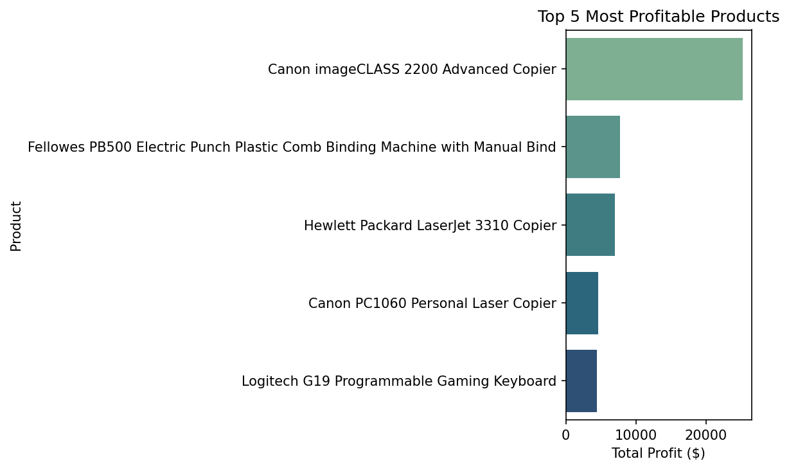
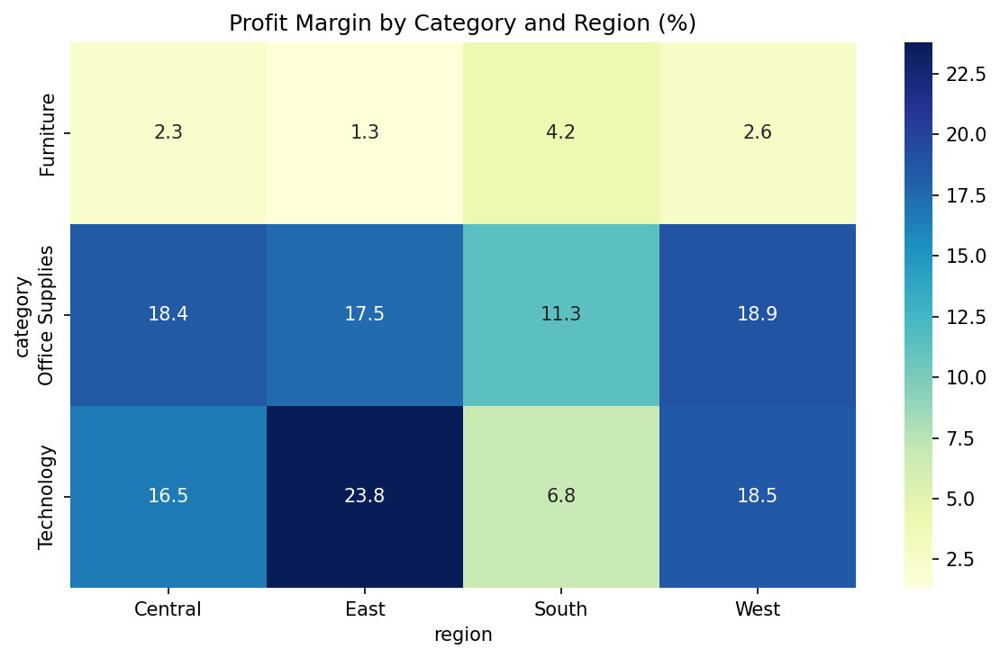

# 🧮 Mini Superstore Analytics Project

An end-to-end **retail sales analysis project** built with **SQL and Python** using the popular *Sample Superstore* dataset.  
The project aims to explore **profitability, discount impact, and regional performance** through data cleaning, relational modeling, SQL queries, and Python visualizations.

---

## 📊 Project Overview

| Component | Description |
|------------|--------------|
| **Goal** | Analyze sales and profit trends to identify key business insights for a retail company. |
| **Dataset** | Sample Superstore (≈10,000 rows, 21 columns) — includes Orders, Products, Customers, and Profit metrics. |
| **Tools Used** | Python (Pandas, Matplotlib, Seaborn), SQL (SQLite/MySQL), Markdown documentation. |
| **Focus Areas** | Profitability analysis, discount efficiency, regional & category performance, time trends. |

---

## 🔍 Business Questions
1. Which are the top 5 most profitable products?  
2. How does profit margin vary by Category and Region?  
3. Which customer segment records the highest loss or return rate?  
4. What is the monthly sales and profit trend?  
5. How does the discount rate affect profitability?

For more details: [`docs/questions.md`](docs/questions.md)

---

## 🧱 Database Schema
The dataset was normalized into 4 main tables:

| Table | Key Fields | Description |
|--------|-------------|-------------|
| **customers** | customer_id, region, segment | Customer demographics and regions |
| **products** | product_id, category, sub_category | Product catalog and classification |
| **orders** | order_id, order_date, ship_date | Order-level details |
| **order_items** | row_id, sales, profit, discount, quantity | Transaction-level metrics |

📄 Full schema: [`docs/schema.md`](docs/schema.md)

---

## ⚙️ Analytical Workflow

1. **Data Preparation:**  
   - Verified data quality (dates, negative values, duplicates).  
   - Split dataset into relational tables.

2. **SQL Analysis:**  
   - Wrote queries to answer each business question.  
   - Computed KPIs like total sales, profit margin, discount impact.

3. **Python Visualization:**  
   - Created charts with Matplotlib & Seaborn.  
   - Saved results as `.png` in `reports/figures/`.

4. **Reporting:**  
   - Summarized key findings in `reports/mini-report.md`.

Full plan: [`docs/analysis_plan.md`](docs/analysis_plan.md)

---

## 📈 Key Performance Indicators (KPIs)

| KPI | Description |
|-----|--------------|
| Total Sales | Overall revenue generated |
| Total Profit | Net earnings after costs |
| Profit Margin (%) | Profit-to-sales ratio |
| Average Discount (%) | Average applied discount |
| Monthly Growth (%) | Month-over-month sales trend |
| Loss-Making Orders (%) | Share of negative-profit transactions |

Visualization plan: [`docs/metrics_and_charts.md`](docs/metrics_and_charts.md)

---

## 🖼️ Example Visuals

| Chart | Description |
|--------|--------------|
|  | Monthly Sales and Profit Trend |
|  | Top 5 Most Profitable Products |
|  | Profit Margin by Category and Region |

---

## 📂 Project Structure

``` 
mini_superstore_analytics/
│
├── data/
│   └── superstore.csv              # Raw dataset (Sample Superstore)
│
├── docs/                           # Project documentation
│   ├── questions.md                # 5 business questions + why they matter
│   ├── schema.md                   # Database schema (tables & relationships)
│   ├── analysis_plan.md            # Step-by-step analytical roadmap
│   ├── metrics_and_charts.md       # KPIs and visualization plan (Python-based)
│   ├── deliverables.md             # List of all outputs and file purposes
│   └── cv_bullets.md               # Short project summary for CV or portfolio
│
├── sql/
│   └── answers.sql                 # SQL queries for each business question
│
├── notebooks/
│   └── eda.ipynb                   # Python notebook for EDA and visualization
│
├── reports/
│   ├── mini-report.md              # Final summary of analysis and insights
│   └── figures/                    # All generated charts (.png)
│       ├── monthly_trend.png
│       ├── top5_products.png
│       └── category_region_heatmap.png
│
└── README.md                       # Main project overview and presentation
``` 

---

## 🧾 Deliverables
See the complete list of files and outputs here:  
[`docs/deliverables.md`](docs/deliverables.md)

---

## 💼 Author
**Adnan Emin Nalçacı**  
Data Analysis Student @ University of Messina  
📧 Contact: [adnanemin39@gmail.com]  
🌐 GitHub: [github.com/Adnanemin]

---

✅ *This README provides an overview of the entire project and serves as its main presentation document.*